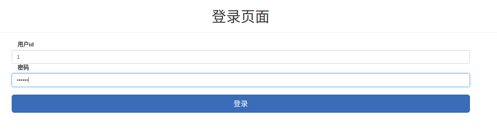
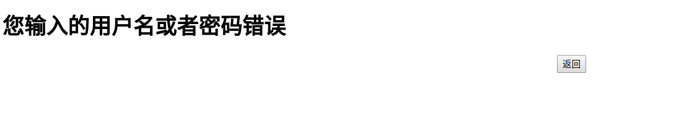
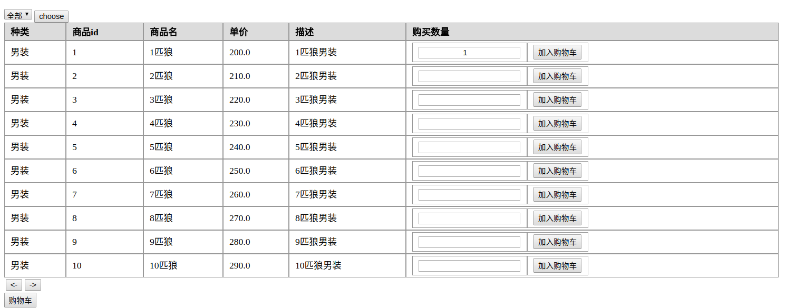
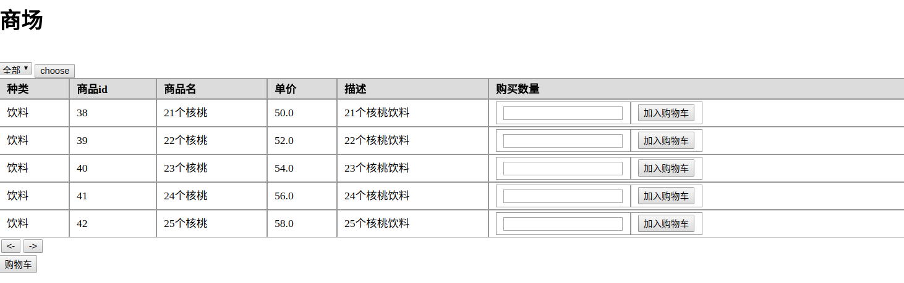
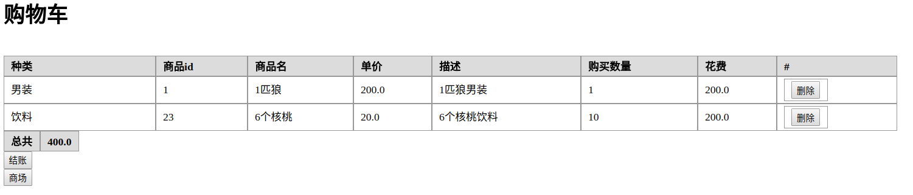
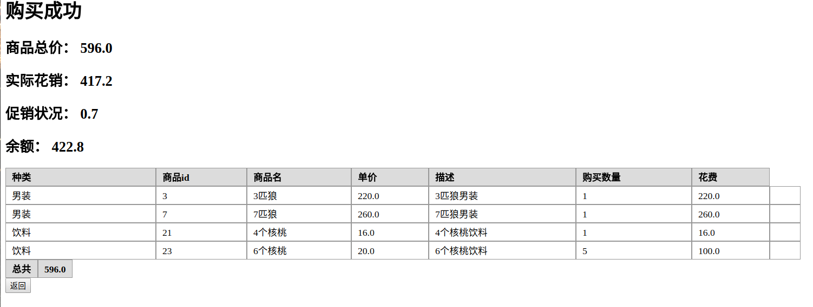
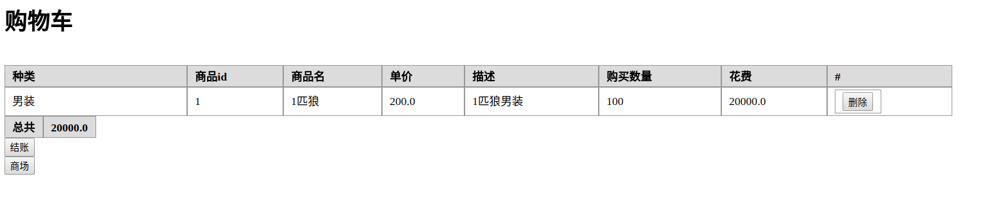
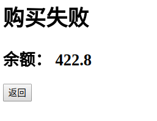
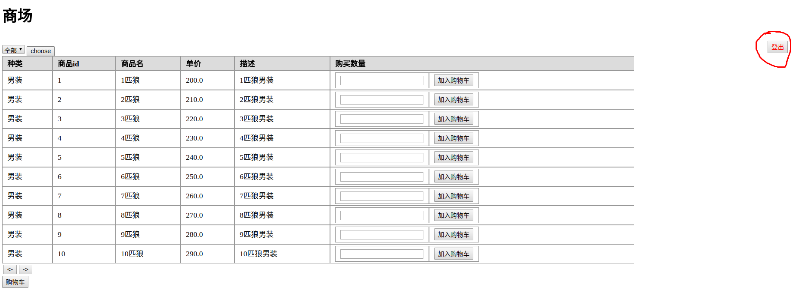

#J2EE 作业二报告

## 1. 效果展示
默认重定向到 http://localhost:8080/Login 进入登录界面
### 1.1 登录
1. 登录界面

2. 可用用户    

| id        | 密码    |  账户余额  |  
| :--------: | :-----:   | :----: |  
| 1        | 123456      |   1000    |  
| 2        | 123456      |   1000    |  
| 3        | 123456      |   1000    |  

3. 跳转逻辑
* 已登录： 跳转到`商场`界面 
* 未登录： 等待登录
* 登录过： 自动填写用户名
* 登录失败： 跳转到登录失败界面
* 登录成功： 跳转到`商场`界面

4. 登录失败界面

### 1.2 商场
1. 商场界面  

2. 功能  
2.1 点击左上角，下拉菜单可以选择查看不同分类，包括男装，饮料，手机三个人分类。选择后点击 `choose` 按钮，确定查看该分类。  
2.2 填写购买数量，并且点击加入购物车，可以将指定数量商品加入购物车当中，若之前购物车中已经存在该商品，则会覆盖掉原有商品。  
2.3 点击表格下方`->` `<-`可以进行翻页，如果现在是第一页，则点击`<-`不会翻页。若现在是最后一页，则点击`->`不会翻页。

2.4 点击购物车，会跳转到购物车界面  

### 1.3 购物车
1. 购物车界面  

2. 功能  
2.1 点击商品删除按钮可以从购物车中删除该商品。  
2.2 如果要修改购买商品数量，可以回到商场界面重新选择数量，覆盖掉当前信息。  
2.3 如果点击结账则会根据情况跳转到购买成功或者失败界面  

### 1.4 购买成功(含折扣)  
1. 购买成功界面  
含有促销功能  

重新回到购物车后，商品清空  

2. 购买失败界面
如果余额不足，则会跳转到失败界面
比如购买超出余额的商品  

会显示  
  
重新回到购物车后，商品会保留，不会被清空  

### 1.5 登出  
1. 在商场界面和购物车界面右上角有登出按钮。    

点击登出后会重新跳转到登录界面  